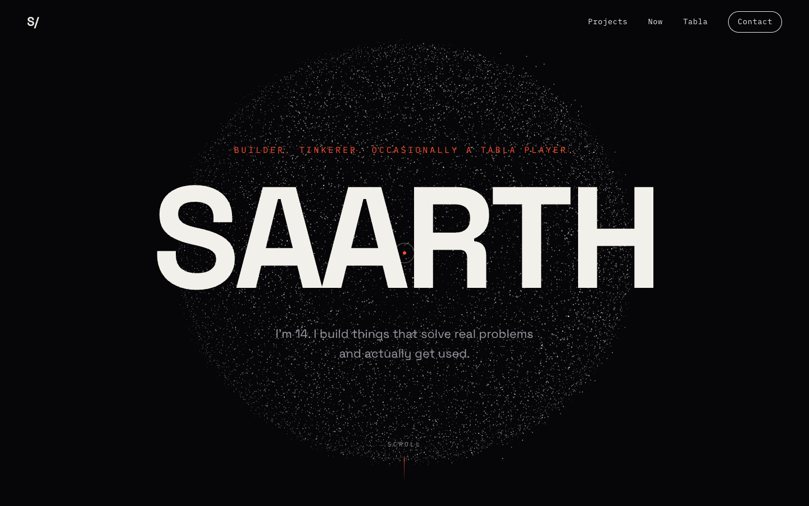

# Saarth's personal site

My personal website. Interactive 3D particles (Three.js), scroll animations (GSAP), and a tabla you can actually play.



## Run it locally

You need [Node.js](https://nodejs.org) installed (any recent version). Then:

```bash
git clone https://github.com/SaarthurR/saarth-site.git
cd saarth-site
npm install
npm run dev
```

Open the link it prints (usually http://localhost:5173) in your browser. That's it.

## Things to try

- Move your mouse through the particle orb on the home screen
- Scroll slowly — the orb dissolves into a DNA helix, then reassembles into a knot at the bottom
- In the tabla section, tap the pads or press keys 1–4 (sound on!)

## Build for deployment

```bash
npm run build
```

Outputs a static site to `dist/` — deployable on Vercel, Netlify, or GitHub Pages.

## Stack

Vite · Three.js (custom shaders) · GSAP + ScrollTrigger · Lenis · Web Audio API
